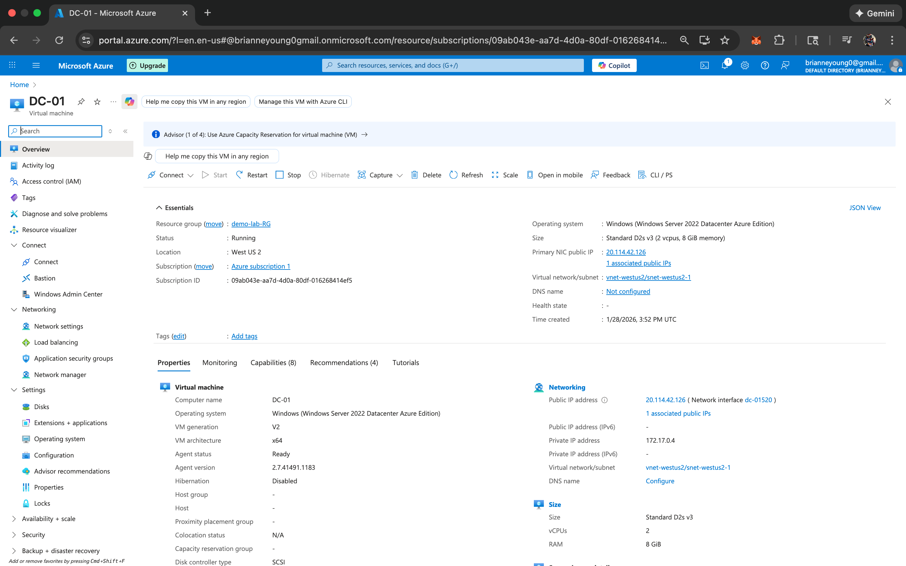

# My Azure & Active Directory Lab: Learning the Basics

## What is this project?
I built this lab to get hands-on experience with the tools used in a professional Help Desk environment. Instead of just reading about it, I wanted to actually build a "mini-company" from scratch in the cloud. 

This project shows how I set up a server, created a network, and managed a group of users (like a real IT department would).

## The Tools I Used
- **Microsoft Azure:** My "virtual office" where the server lives.
- **Windows Server 2022:** The "brain" of the operation.
- **Active Directory:** The tool I used to manage people, passwords, and permissions.
- **Remote Desktop:** How I connected to the server from my own laptop.

---

## What I Did (Step-by-Step)

### 1. Building the Server
I started by creating a Virtual Machine in Azure. Think of this as buying a new computer and plugging it into a cloud network. I had to set up the "security guards" (Network Security Groups) to make sure I could log in safely.

 
<em>My server is up and running in the Azure portal!</em>

---

### 2. Making the Server a "Boss" (Domain Controller)
I installed **Active Directory** to turn my server into a "Domain Controller." I used the wizard to add the necessary features and then verified everything was healthy on the dashboard.

  
  
   
  <em>Left: Installing the AD role | Right: My server dashboard is all green and ready!</em>

### 3. Organizing the Office (OUs & Groups)
I created "Folders" (Organizational Units) to keep admins and employees separate. I also created **Security Groups** (like 'Mushroom_Kingdom_Admins') so I can give the right people access to the right files.

  
  
  
   
  <em>Creating folders, making VIP groups, and assigning permissions.</em>

### 4. Bulk Onboarding with PowerShell
Instead of creating 10 users manually, I wrote a simple script to create them all at once. This shows how I can use automation to save time and prevent mistakes during the onboarding process.

  
  
   
  <em>Left: My script running in PowerShell | Right: All the new users created automatically!</em>

### 5. Setting the "Office Rules" (Group Policy)
I set up a security rule that locks an account if someone tries the wrong password 3 times. This is a key part of keeping the company safe from hackers.

 
<em>Setting the "3 strikes and you're out" password rule.</em>

---

## Key Concepts I Focused On

- **Least Privilege:** I only gave users the access they needed for their specific roles.
- **PII Protection:** I organized the data to ensure sensitive information stays private.
- **Scalability:** I built the system so it's easy to add 5 users or 500 users.
- **Security Posture:** I used GPOs to enforce strong password rules and account lockouts.

---

## What I Learned
- How to set up a cloud environment from scratch.
- How to manage users and keep them in the right groups.
- **Most importantly:** I learned how to troubleshoot when things don't go as planned!

---

## Conclusion: Why This Lab Matters

Building this environment from scratch taught me that Active Directory is the "heart" of a company's IT system. It’s not just about creating accounts; it’s about making sure the right people have access to the right things at the right time.

Through this project, I gained confidence in:
1. **Cloud Basics:** I’m now comfortable navigating the Azure portal and managing virtual servers.
2. **The "User Lifecycle":** I understand the full journey of an employee’s access—from their first day of onboarding to managing their security permissions as they grow with the company.
3. **The "Security First" Mindset:** I learned that small settings, like a Group Policy or a "Least Privilege" rule, are what keep a company's data safe from outside threats.

This lab has prepared me to walk into a professional environment and confidently assist users with their most common (and most critical) technical needs.
