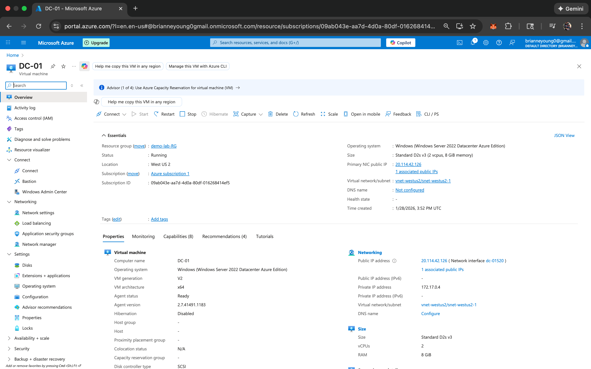
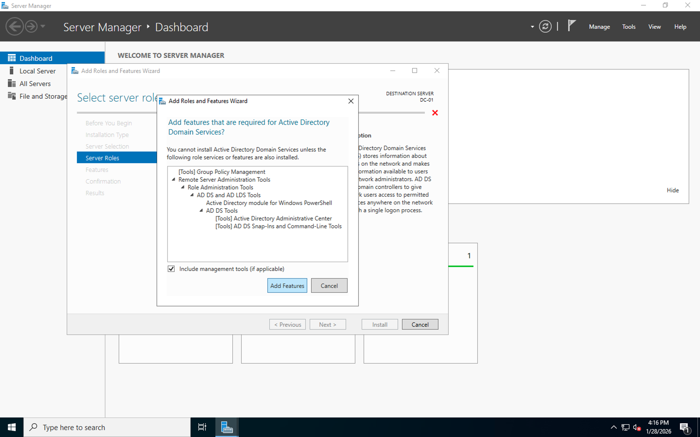
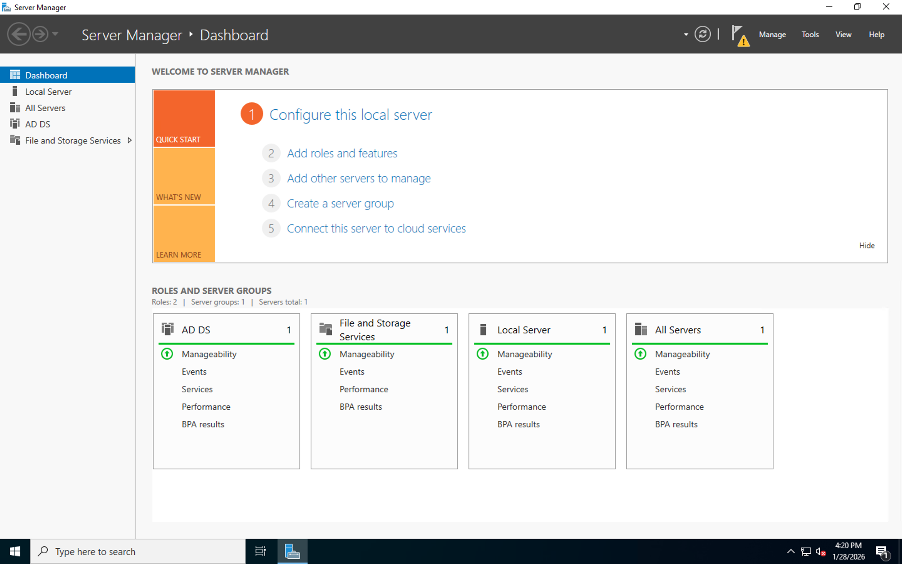
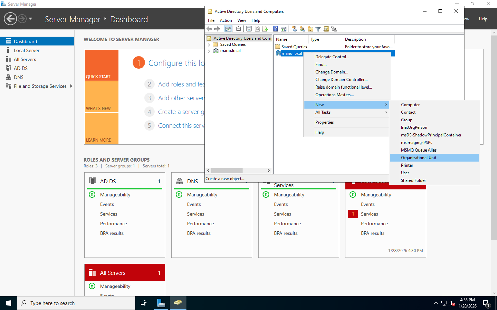
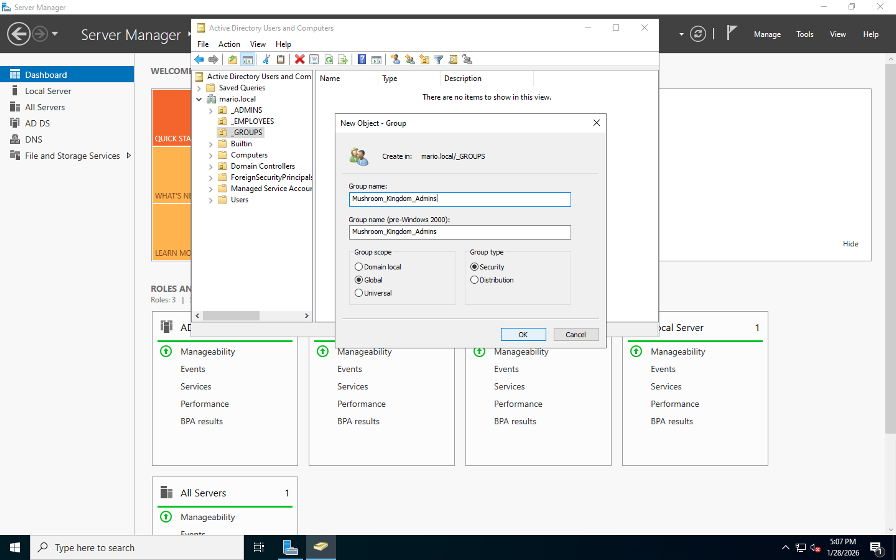
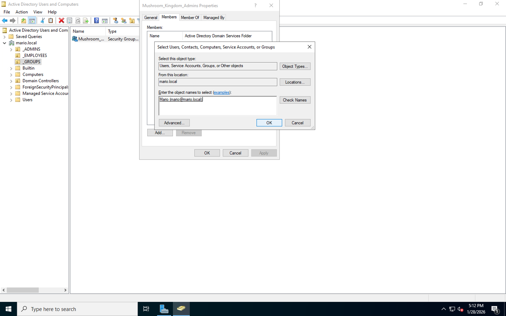
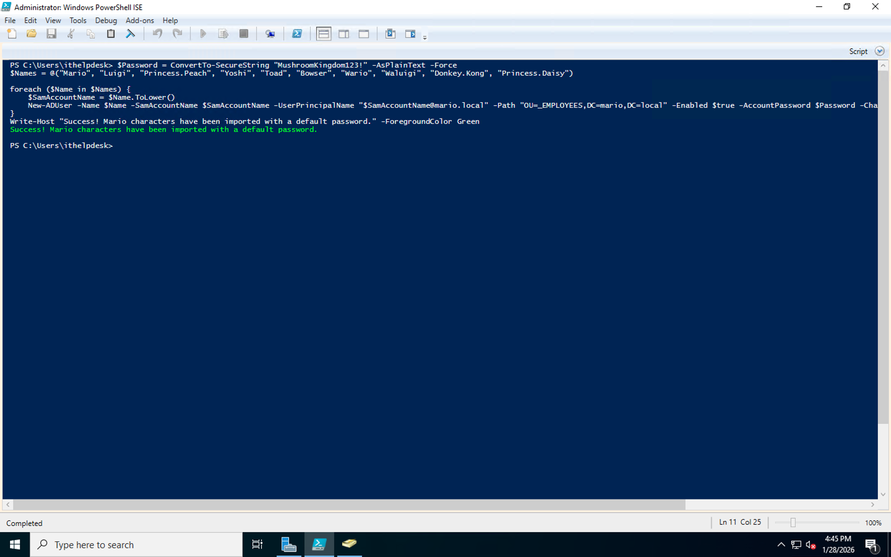
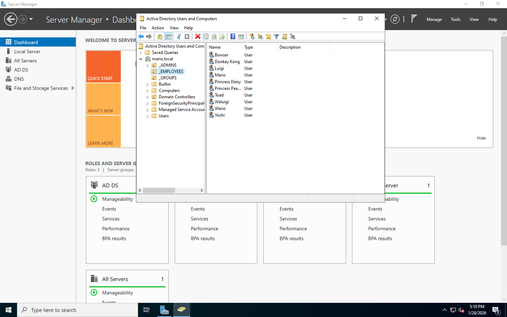
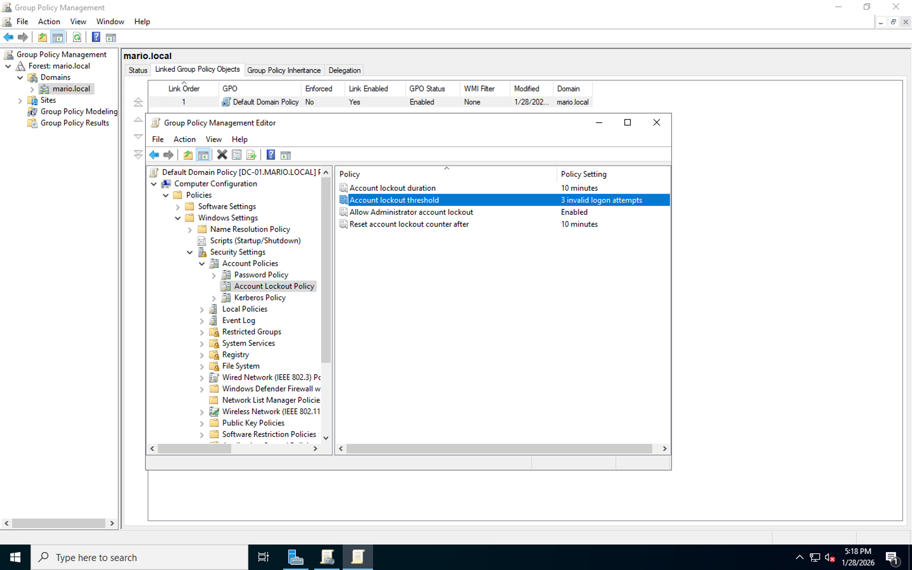

# Active Directory User Management Lab

## Overview

Deployed a Windows Server 2022 virtual machine in Microsoft Azure and configured it as a domain controller running Active Directory Domain Services (AD DS). This project covers the full user lifecycle: account provisioning, Organizational Unit (OU) structure, security group management, bulk user creation with PowerShell, and Group Policy Object (GPO) configuration for security baselines.

## Tools Used

- **Microsoft Azure** — Cloud platform used to host the Windows Server VM
- **Windows Server 2022** — Server operating system configured as a domain controller
- **Active Directory (ADUC)** — Used for user account management, OU structure, and security group assignments
- **PowerShell** — Automated bulk user creation for efficient onboarding
- **Group Policy (GPO)** — Configured account lockout policies to enforce security baselines
- **Remote Desktop (RDP)** — Used to connect to and manage the Azure VM remotely

---

## What I Did

### 1. Deployed the Server in Azure

Created a Windows Server 2022 Virtual Machine in Azure, configured Network Security Groups to allow RDP access, and connected to the server remotely. This serves as the foundation for the entire Active Directory environment.

*Windows Server 2022 VM running in Azure — status showing as active and accessible via RDP.*

---

### 2. Installed Active Directory Domain Services

Installed the AD DS role through Server Manager and promoted the server to a domain controller. After configuration, verified all services were running correctly on the Server Manager dashboard.

<table>
  <tr>
    <td></td>
    <td></td>
  </tr>
  <tr>
    <td><em>Left: Installing the Active Directory Domain Services role via Server Manager.</em></td>
    <td><em>Right: Server Manager dashboard showing all services healthy after domain controller promotion.</em></td>
  </tr>
</table>

---

### 3. Created Organizational Units & Security Groups

Built an OU structure to organize user accounts by role (Admins and Employees), mirroring how a real company separates access levels. Created security groups to manage permissions through Role-Based Access Control (RBAC) — granting access to groups rather than individual users, which makes adding and removing permissions efficient and scalable.

<table>
  <tr>
    <td></td>
    <td></td>
    <td></td>
  </tr>
  <tr>
    <td><em>Left: Creating Organizational Units to structure accounts by role.</em></td>
    <td><em>Middle: Setting up security groups for Role-Based Access Control.</em></td>
    <td><em>Right: Assigning users to the appropriate security groups.</em></td>
  </tr>
</table>

---

### 4. Automated Bulk User Creation with PowerShell

Instead of manually creating user accounts one at a time, I wrote a PowerShell script to bulk-create 10 users at once. This demonstrates how automation can streamline the onboarding process, reduce manual errors, and save time — especially in environments with frequent new hires.

<table>
  <tr>
    <td></td>
    <td></td>
  </tr>
  <tr>
    <td><em>Left: PowerShell script executing bulk user creation.</em></td>
    <td><em>Right: All 10 user accounts successfully created and visible in Active Directory Users and Computers.</em></td>
  </tr>
</table>

---

### 5. Configured Group Policy for Account Security

Created a Group Policy Object (GPO) to enforce an account lockout policy: after 3 failed login attempts, the account locks automatically. This is a standard security measure that protects against brute-force password attacks while still allowing legitimate users to reset their access through IT.

*Group Policy Management Editor showing the account lockout policy configuration — 3 invalid attempts triggers automatic lockout.*

---

## Key Takeaways

- **Cloud Infrastructure** — Comfortable navigating the Azure portal, deploying VMs, configuring networking, and connecting via RDP
- **Active Directory Administration** — Practiced user account creation, OU organization, security group management, and domain controller configuration
- **User Lifecycle Management** — Understand the full process from onboarding (account creation, group assignment, access provisioning) through managing permissions as roles change
- **Automation** — Used PowerShell to automate repetitive tasks, reducing manual effort and potential errors during bulk onboarding
- **Security Baselines** — Applied Group Policy to enforce account lockout policies, implementing a defense against unauthorized access attempts
- **Least Privilege Principle** — Structured OUs and security groups so users only have access to what their role requires
